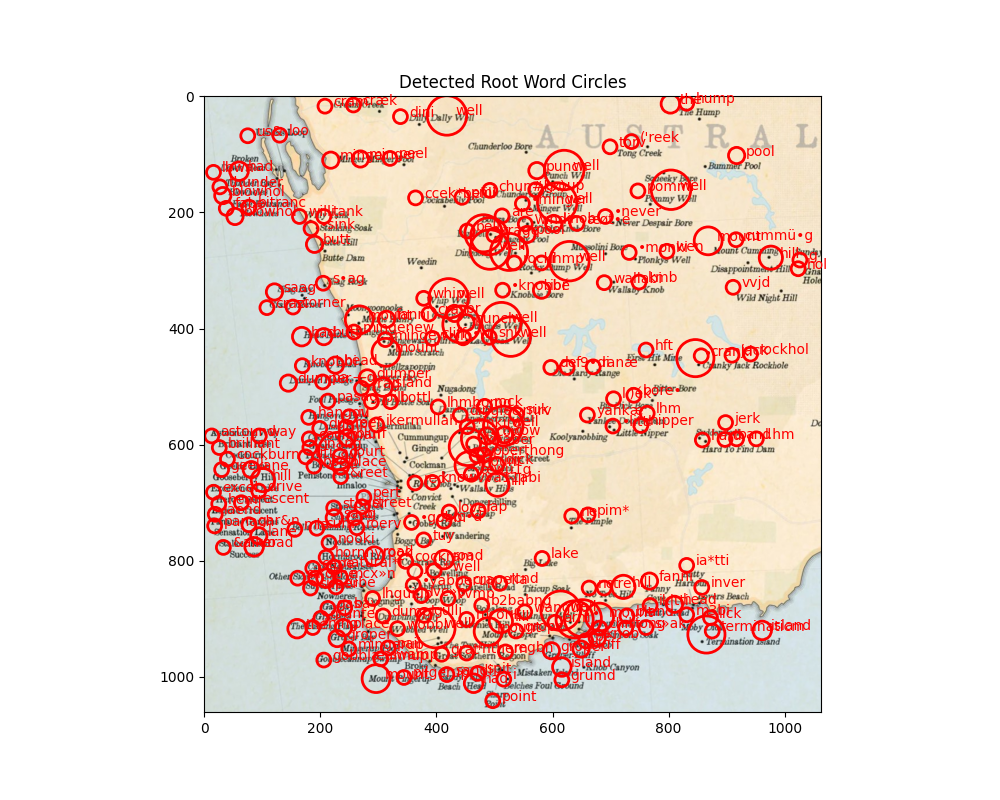

# Root Word Frequency Visualization on Maps Using OCR and Stemming
This project visualizes root word frequencies extracted from images using Optical Character Recognition (OCR) and stemming techniques. The extracted words are dynamically represented as circles overlaid on a map, with circle sizes proportional to word frequency. This tool provides an interactive way to analyze text data from images in a geospatial context.

## Features
- **OCR Integration**: Extracts text from images using the OCR.space API.
- **Root Word Stemming**: Applies Snowball stemming to group words by their root form.
- **Dynamic Circle Overlays**: Visualizes word frequencies by drawing circles on the map, with sizes relative to word occurrences.
- **Geospatial Visualization**: Plots recognized words over map images, allowing for interactive analysis.

## Installation
1. **Clone the repository**:
   ```bash
   git clone https://github.com/SPVillacorta/OCR-WordFreqMap.git
   cd RootWordMapVis
   ```

2. **Install the required dependencies**:
   ```bash
   pip install -r requirements.txt
   ```

3. **Set up the OCR API**:
   - Sign up at [OCR.space](https://ocr.space/) to get your API key.
   - Replace the placeholder API key in the code (`API_KEY = 'XXXXXXXXXX'`) with your own.

4. **Run the application**:
   ```bash
   python main.py
   ```

## Usage

1. **Prepare an image**:
   Place the image file (e.g., "Perth3.jpg") in the project folder or specify the path in the `image_path` variable.

2. **Analyze root words**:
   The script will use OCR to extract text from the image, stem the words, and then visualize their frequencies on the map by drawing dynamic circle overlays. Each circle represents a word, with its size proportional to the word's frequency.

3. **Custom Keywords**:
   The script currently focuses on specific root words (`sandstone`, `lake`, `hill`). You can modify the `keywords` list in the code to track other words relevant to your analysis.

## Example Output

The program overlays detected words as circles on the map, with each circle size proportional to the word’s frequency. Words are also annotated next to the circles.



## Dependencies
- Python 3.x
- `matplotlib`
- `requests`
- `Pillow`
- `spacy`
- `nltk`
- `wordcloud`

Install these by running:
```bash
pip install matplotlib requests pillow spacy nltk wordcloud
```

## License
This project is licensed under the MIT License - see the [LICENSE](LICENSE) file for details.

## Acknowledgments
- [OCR.space](https://ocr.space/) for the OCR API used in this project.
- [SpaCy](https://spacy.io/) and [NLTK](https://www.nltk.org/) for NLP tools.
- [Matplotlib](https://matplotlib.org/) for visualization support.
- Special thanks to **Behnam Sadeghi** for sharing the original draft idea that inspired this project. The current version was rebuilt and improved based on his initial concept.
